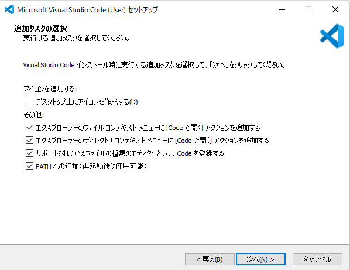
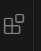
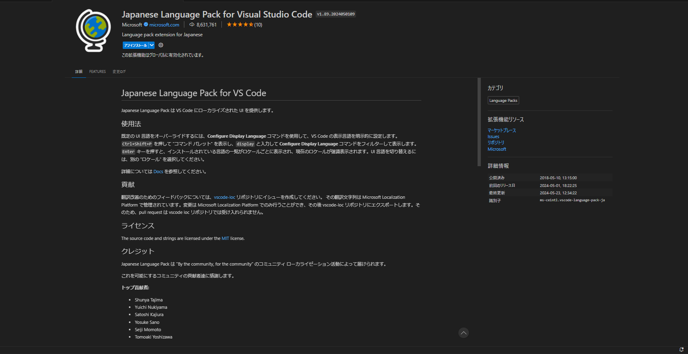
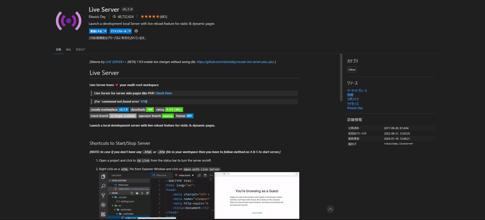

# 環境構築

## エディタ

基本的にどのエディタを使用しても問題が無いよう作成しますが、**Visual Studio Code**(以下、VSCode)をお勧めします。

### リンク

https://code.visualstudio.com/download

### セットアップ

基本的に「次へ」を押してもらえば大丈夫ですが、「追加タスクの選択」の画面でその他の項目を全てチェックを入れておくと便利です。

### 拡張機能の導入

インストールが完了したら VSCode を開き、左側にあるメニューのこのようなアイコンのボタンをクリックしてください。

検索窓で検索を行い、下記の 2 つの拡張機能をインストールしてください。
Japanese Language Pack for Visual Studio Code

Live Server

