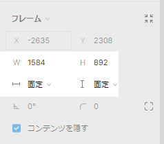

# width, height



Width(ウィズ): 幅
Height(ハイト): 高さ

サイズ指定はいくつかの方法がある。
その中でいくつかの単位を記載。

- px
  ピクセル指定
- %
  親要素に対してのパーセンテージ指定
- vh
  画面サイズに対する高さを指定

## css の適用方法

### html に直書き

```html
<div style="background-color: red;"></div>
```

### id

```html
<!-- 「hoge」というidを指定 -->
<div id="hoge"></div>
```

```css
/* hogeというidがつけられた要素にスタイルを指定する */
#hoge {
  /* ここにスタイルを適用する。 */
}
```

### class

```html
<!-- 「fuga」というclassを指定 -->
<div class="fuga"></div>
<div class="fuga"></div>
<div class="fuga"></div>
```

```css
/* fugaというclassがつけられた要素にスタイルを指定する */
.fuga {
  /* ここにスタイルを適用する */
}
```

## Figma のレイアウト再現

### Fixed width(固定)

```html
<div id="fixedParent" style="background-color: gray;">
  <div class="fixedWidth" style="background-color: red;"></div>
  <div class="fixedWidth" style="background-color: green;"></div>
  <div class="fixedWidth" style="background-color: blue;"></div>
</div>
```

```css
/* 固定幅親要素 */
#fixedParent {
  width: 1000px;
  height: 1000px;
}

/*固定幅子要素 */
.fixedWidth {
  width: 200px;
  height: 200px;
}
```

### Hug contents（内包）

```html
<div id="HugParent" style="background-color: gray;">
  <div class="hugContents" style="background-color: red;"></div>
  <div class="hugContents" style="background-color: green;"></div>
  <div class="hugContents" style="background-color: blue;"></div>
</div>
```

ブロック要素の場合は`width: auto;`(初期値)だと`#hugParent`の幅が親要素いっぱいに広がってしまうため、`width: fit-content;`の指定が必要。
ブロック要素の`height:auto;`(初期値)は子要素の高さの合計が高さとなるため、指定が不要。
「ブロック要素」やその他の要素の違いに関しては今後の勉強会で実施。

```css
/* 内包親要素 */
#hugParent {
  width: fit-content;
}

/* 内包子要素 */
.hugContents {
  width: 200px;
  height: 200px;
}
```

### fill container(拡大)

```html
<div id="fillParent" style="background-color: gray">
  <div class="fillContainer" style="background-color: red"></div>
  <div class="fillContainer" style="background-color: green"></div>
  <div class="fillContainer" style="background-color: blue"></div>
</div>
```

```css
/* 拡大親要素 */
#fillParent {
  width: 1000px;
  height: 1000px;
}

/* 拡大子要素 */
.fillContainer {
  width: 100%;
  height: calc(100% / 3);
}
```
