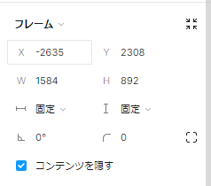

# Figma でよく使う機能を css で再現する

## width, height とは


Width(ウィズ): 幅
Height(ハイト): 高さ

サイズ指定はいくつかの方法がある。

- px
  ピクセル指定
- %
  親要素に対してのパーセンテージ指定
- vh
  画面サイズに対する高さを指定

### Figma のレイアウト再現

#### Fixed width(固定)

```html
<div id="fixedParent" style="background-color: gray;">
  <div class="fixedWidth" style="background-color: red;"></div>
  <div class="fixedWidth" style="background-color: green;"></div>
  <div class="fixedWidth" style="background-color: blue;"></div>
</div>
```

```css
/* 固定幅親要素 */
#fixedParent {
  width: 1000px;
  height: 1000px;
}

/*固定幅子要素 */
.fixedWidth {
  width: 200px;
  height: 200px;
}
```

#### Hug contents（内包）

```html
<div id="HugParent" style="background-color: gray;">
  <div class="hugContents" style="background-color: red;"></div>
  <div class="hugContents" style="background-color: green;"></div>
  <div class="hugContents" style="background-color: blue;"></div>
</div>
```

```css
/* 内包親要素 */
/* .hugContentsはwidthやheightを指定しない */

/* 内包子要素 */
.hugContents {
  width: 200px;
  height: 200px;
}
```

#### fill container(拡大)

```html
<div id="fillParent" style="background-color: gray">
  <div class="fillContainer" style="background-color: red"></div>
  <div class="fillContainer" style="background-color: green"></div>
  <div class="fillContainer" style="background-color: blue"></div>
</div>
```

```css
/* 拡大親要素 */
#fillParent {
  width: 1000px;
  height: 1000px;
}

/* 拡大子要素 */
.fillContainer {
  width: 100%;
  height: calc(100% / 3);
}
```

## padding

## margin
