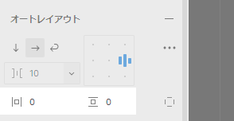

## padding&margin

Auto layout では padding を指定できる
(後述する flexbox プロパティを利用する場合は margin を使う機会が少ない)


padding: 内余白
margin: 外余白

```html
<h3>余白指定なし</h3>
<div class="parent">
  <div class="child"></div>
</div>

<h3>余白指定</h3>
<div class="parent" id="adjustedparent">
  <div class="child"></div>
</div>
```

```css
.parent {
  width: 200px;
  height: 200px;
  background-color: red;
}

.child {
  width: 50%;
  height: 50%;
  background-color: gray;
}

#adjustedParent {
  margin: 50px;
  /* margin-topなどでも指定可能 */
  /* margin-top: 5px; */
  padding: 100px 100px 100px 100px;
}
```
